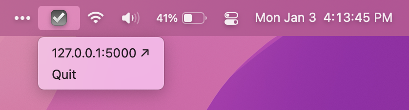

## ☑️ things-api

This app tries to connect to your [Things 3 database file][1] and serve the 
contents through a Flask-powered API at `127.0.0.1:5000`. It's recommended to
back up the database before running this app.

Very much still a WIP. Assume it will :boom: destroy :boom: your Things 3 
database. Make a backup. 

### Building

1. Install Pipenv:

    ```console
    pip install pipenv
    ```
   
2. Install dependencies:

    ```console
    pipenv install
    ```

3. Build the app:
    ```console
    python setup.py py2app
    ```

### Running

1. Open `things-api.app`

2. Look in the menu bar for the ☑️ icon:

   

3. Visit [127.0.0.1:5000/tasks](http://127.0.0.1/tasks)

[1]: https://culturedcode.com/things/support/articles/2982272/#get-the-things-3-database-file